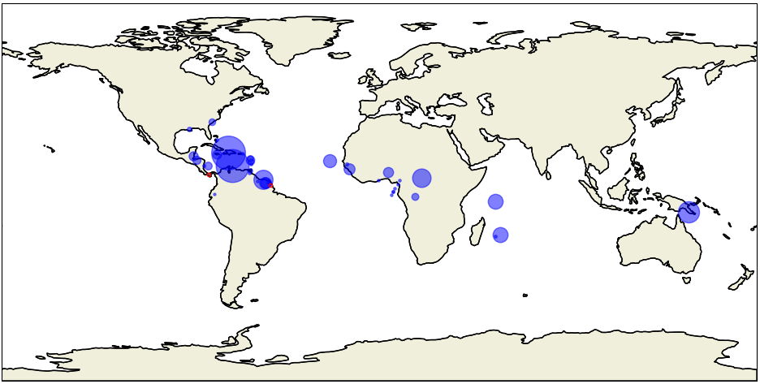
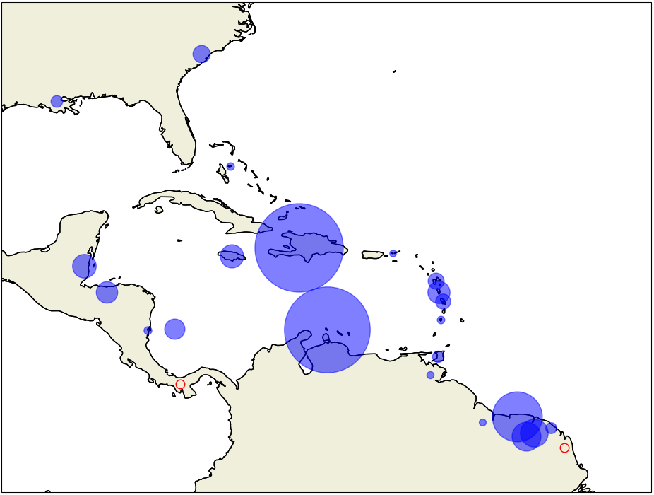

# Kreyòl-MT

📄 Paper: ["Kreyòl-MT: Building Machine Translation for Latin American, Caribbean, and Colonial African Creole Languages"](https://arxiv.org/abs/2405.05376)

⚠️ Data download link(s) coming soon! (HF and LDC)

⚠️ Model download link(s) coming soon! (HF)

## Building Machine Translation for Latin American, Caribbean, and Colonial African Creole Languages

Goal: include data for each of the following languages

*African-diaspora Creole languages of the Americas* 🌎
 - Saint Lucian (`acf`)
 - Bahamian Creole (`bah`)
 - Berbice Dutch (`brc`)
 - Belizean (`bzj`)
 - Miskito Coast Creole (`bzk`)
 - Garifuna (`cab`)
 - Negerhollands (`dcr`)
 - Ndyuka (`djk`)
 - Guadeloupean (`gcf`)
 - French Guianese (`gcr`)
 - Gullah (`gul`)
 - Creolese (`gyn`)
 - Haitian (`hat`)
 - San Andrés-Provencia (`icr`)
 - Jamaican (`jam`)
 - Louisiana (`lou`)
 - Martinican (`mart1259`)
 - Media Lengua (`mue`)
 - Papiamento (`pap`)
 - Saramaccan (`srm`)
 - Sranan Tongo (`srn`)
 - Vincentian Creole (`svc`)
 - Trinidadian Creole (`trf`) 

*Creole languages of Africa* 🌍
 - Angolar (`aoa`)
 - Saotomense (`cri`)
 - Seychellois (`crs`)
 - Annobonese (`fab`)
 - Fanakalo (`fng`)
 - Pichi (`fpe`)
 - Ghanaian Pidgin (`gpe`)
 - Kabuverdianu (`kea`)
 - Krio (`kri`)
 - Kituba (`ktu`)
 - Mauritian (`mfe`)
 - Naija (`pcm`)
 - Guinea-Bissau Creole (`pov`)
 - Principense (`pre`)
 - Réunion Creole (`rcf`)
 - Sango (`sag`)
 - Cameroonian Pidgin (`wes`)

*Other Creole languages* 🌏
 - Tok Pisin (`tpi`)

*...with target languages* 🎯
- English (`eng`)
- French (`fra`)
- Arabic (`ara`)
- Azerbaijani (`aze`)
- Cebuano (`ceb`)
- German (`deu`)
- Haitian (`hat`)
- Nepali (`nep`)
- Portuguese (`por`)
- Spanish (`spa`)
- Chinese (`zho`)

---

**_Using ISO 639-3 codes_**

## Citation

Please cite:

```
@article{robinson2024krey,
  title={Krey$\backslash$ol-MT: Building MT for Latin American, Caribbean and Colonial African Creole Languages},
  author={Robinson, Nathaniel R and Dabre, Raj and Shurtz, Ammon and Dent, Rasul and Onesi, Onenamiyi and Monroc, Claire Bizon and Grobol, Lo{\"\i}c and Muhammad, Hasan and Garg, Ashi and Etori, Naome A and others},
  journal={arXiv preprint arXiv:2405.05376},
  year={2024}
}
```




